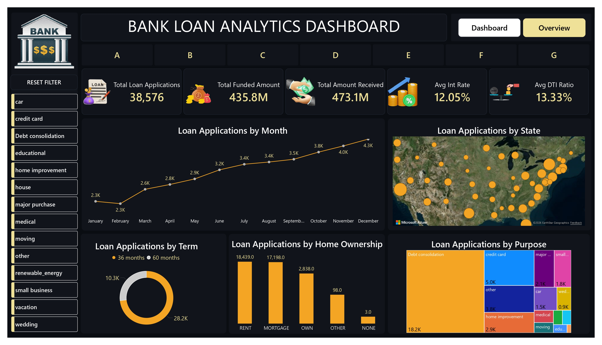
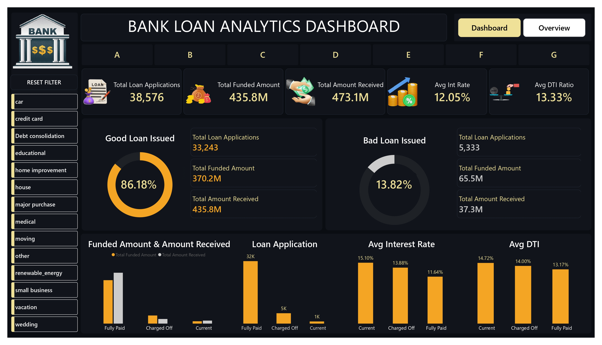

# 🏦 Bank Loan Analytics Dashboard

## 📊 Project Overview
The **Bank Loan Analytics Dashboard** is an end-to-end Business Intelligence project developed using **Power BI, SQL, and Excel** to analyze loan application data and uncover actionable business insights.
The dashboard enables financial institutions to monitor loan performance, evaluate customer behavior, assess risk levels, and support data-driven lending decisions.

## 🎯 Project Objectives
* Analyze loan application trends
* Monitor funded and received loan amounts
* Evaluate Good Loans vs Bad Loans
* Identify high-risk customer segments
* Track loan performance across states and purposes
* Support business decision-making through interactive visualizations

## 📂 Dataset Information
The dataset contains loan-related information, including:
* Loan Applications
* Loan Status
* Funded Amount
* Amount Received
* Interest Rate
* Debt-to-Income (DTI) Ratio
* Loan Purpose
* Home Ownership
* Customer Demographics
* State Information

**Data Source:** CSV Dataset
## 🛠️ Tools & Technologies
| Tool        | Purpose                        |
| ----------- | ------------------------------ |
| Power BI    | Dashboard Development          |
| SQL         | Data Analysis & Querying       |
| Excel / CSV | Data Source                    |
| Power Query | Data Cleaning & Transformation |
| DAX         | KPI Calculations & Measures    |

## 🔄 Project Workflow

### 1️⃣ Data Collection
* Imported loan dataset
* Reviewed data quality and structure

### 2️⃣ Data Cleaning
* Handled missing values
* Standardized formats
* Removed inconsistencies

### 3️⃣ Data Modeling
* Created relationships between tables
* Built an optimized data model

### 4️⃣ KPI Development
* Total Loan Applications
* Total Funded Amount
* Total Amount Received
* Average Interest Rate
* Average DTI Ratio

### 5️⃣ Dashboard Development
* Interactive visualizations
* Dynamic filtering and slicing
* Loan performance tracking
  
## 📊 Dashboard Preview
## 📊 Dashboard Preview

### 🔹 Dashboard Overview

This dashboard provides a high-level overview of loan applications, funded amounts, repayments, interest rates, DTI ratios, loan purposes, and state-wise loan distribution.

### 🔹 Loan Performance Analysis

This view focuses on Good Loans vs Bad Loans analysis, funded amount tracking, repayment performance, average interest rate, and DTI analysis to evaluate loan portfolio health.

### Dashboard Highlights

* 📈 Monthly Loan Application Trends
* 💰 Total Funded Amount Analysis
* 💵 Total Amount Received Tracking
* 🏦 Good Loan vs Bad Loan Analysis
* 📍 State-wise Loan Distribution
* 🏠 Home Ownership Analysis
* 🎯 Loan Purpose Breakdown
* 📊 Interest Rate & DTI Analysis
* 🔍 Interactive Filters & Slicers

### Bank Loan Analytics Dashboard

### Dashboard Highlights
* 📈 Monthly Loan Application Trends
* 💰 Total Funded Amount Analysis
* 💵 Amount Received Tracking
* 🏦 Good Loan vs Bad Loan Analysis
* 📍 State-wise Loan Distribution
* 🎯 Loan Purpose Analysis
* 🏠 Home Ownership Insights
* 📊 Interest Rate & DTI Analysis

## 📌 Key Performance Indicators (KPIs)
| KPI                     | Description                   |
| ----------------------- | ----------------------------- |
| Total Loan Applications | Total number of loan requests |
| Total Funded Amount     | Total approved loan amount    |
| Total Amount Received   | Loan repayments received      |
| Average Interest Rate   | Average interest charged      |
| Average DTI Ratio       | Customer debt-to-income ratio |

## 📈 Key Insights
* ✅ Good Loans accounted for **83.33%** of total applications.
* 💰 Total Funded Amount reached **435.8M**.
* 💳 Debt Consolidation and Credit Card loans were among the most common loan purposes.
* 📈 Monthly loan applications demonstrated steady growth.
* 📍 Loan distribution varied significantly across states.
* 🎯 Customer risk profiles were effectively identified using DTI and loan status metrics.
  
## 📁 Project Files
| File                     | Description           |
| ------------------------ | --------------------- |
| Bank_Loan_Analytics.pbix | Power BI Dashboard    |
| financial_loan.csv       | Dataset               |
| Dashboard.png            | Dashboard Screenshot  |
| README.md                | Project Documentation |

## 🚀 Skills Demonstrated
* Data Cleaning & Transformation
* SQL Analysis
* Data Modeling
* DAX Calculations
* Data Visualization
* Dashboard Development
* Business Intelligence
* Financial Data Analysis

## 📥 How to Use
1. Download the `.pbix` file.
2. Open it using Power BI Desktop.
3. Refresh the dataset if required.
4. Explore dashboards using filters and slicers.

## 👨‍💻 Author
**Sagar Patil**
💼 LinkedIn: [www.linkedin.com/in/sagarpatil-data-analyst](http://www.linkedin.com/in/sagarpatil-data-analyst)
🐙 GitHub: https://github.com/SP5558
⭐ If you found this project helpful, consider giving it a star!
